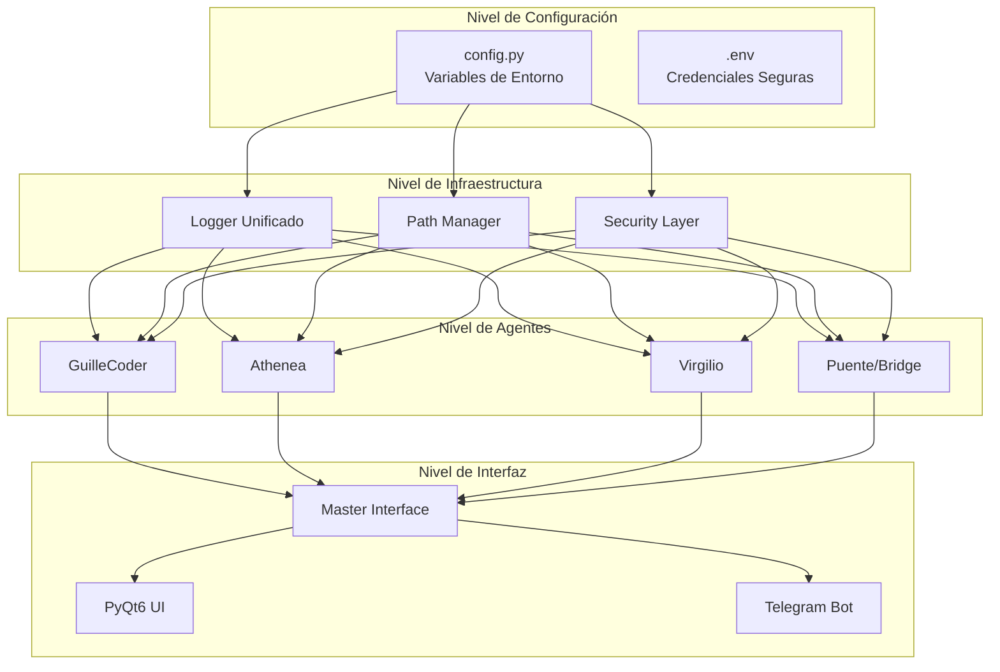

# 🏗️ PLAN DE FINALIZACIÓN - CAMASOTS_MASTER

## 📋 Resumen Ejecutivo

Este documento detalla el plan completo para finalizar profesionalmente el proyecto CAMASOTS_MASTER, abordando las 43 tareas identificadas en 6 fases secuenciales.

---

## 🎯 ARQUITECTURA OBJETIVO



---

## 📁 ESTRUCTURA DE ARCHIVOS FINAL

```
CAMASOTS_MASTER/
├── 📁 src/
│   ├── 📁 camasots/                 # Package principal
│   │   ├── __init__.py
│   │   ├── config.py               # Configuración centralizada ⭐
│   │   ├── logger.py               # Logging unificado ⭐
│   │   ├── security.py             # Capa de seguridad ⭐
│   │   └── utils.py                # Helpers reutilizables
│   │
│   ├── 📁 agents/
│   │   ├── __init__.py
│   │   ├── guillecoder/
│   │   │   ├── __init__.py
│   │   │   └── engine.py           # (antes guille_engine.py)
│   │   ├── athenea/
│   │   │   ├── __init__.py
│   │   │   └── engine.py           # (antes athenea_engine.py)
│   │   ├── virgilio/
│   │   │   ├── __init__.py
│   │   │   └── bot.py              # (antes virgilio_v3.py)
│   │   └── telegram/
│   │       ├── __init__.py
│   │       └── bot.py              # (antes telegram_bot.py)
│   │
│   ├── 📁 bridge/
│   │   ├── __init__.py
│   │   ├── core.py                 # (antes bridge_core.py)
│   │   ├── master.py               # (antes bridge_master.py)
│   │   ├── controller.py
│   │   ├── evolution.py
│   │   ├── backup.py
│   │   └── auto_repair.py
│   │
│   ├── 📁 interface/
│   │   ├── __init__.py
│   │   ├── master_interface.py
│   │   └── main_window.py
│   │
│   └── 📁 database/
│       ├── __init__.py
│       └── models.py
│
├── 📁 tests/
│   ├── __init__.py
│   ├── conftest.py                 # Configuración pytest
│   ├── test_config.py
│   ├── test_security.py
│   ├── 📁 agents/
│   │   ├── test_guillecoder.py
│   │   ├── test_athenea.py
│   │   └── test_virgilio.py
│   └── 📁 bridge/
│       ├── test_core.py
│       └── test_master.py
│
├── 📁 docs/
│   ├── 📁 api/                     # Documentación OpenAPI
│   ├── 📁 user/                    # Guía de usuario
│   └── 📁 dev/                     # Guía de desarrollo
│
├── 📁 config/
│   ├── .env.example                # Template de variables
│   └── settings.yaml               # Configuración estática
│
├── 📁 scripts/
│   ├── build.ps1                   # Build de Windows
│   ├── build.sh                    # Build de Linux/Mac
│   ├── setup.iss                   # Inno Setup installer
│   └── deploy.ps1                  # Script de despliegue
│
├── 📁 build/                       # PyInstaller output
├── 📁 dist/                        # Distribuibles finales
│
├── .gitignore                      # Excluir credenciales
├── .env                            # NO versionar - credenciales locales
├── requirements.txt
├── requirements-dev.txt
├── pyproject.toml                  # Configuración moderna
├── setup.py
├── pytest.ini
├── Makefile
├── LICENSE
├── SECURITY.md                     # Política de seguridad
├── CHANGELOG.md                    # Historial de cambios
└── README.md                       # Documentación principal
```

---

## 🔧 IMPLEMENTACIÓN POR FASES

### FASE 1: SEGURIDAD CRÍTICA 🚨

#### 1.1 Sistema de Configuración Centralizado

**Archivo nuevo:** `src/camasots/config.py`

```python
"""
Sistema de configuración centralizado para CAMASOTS_MASTER.
Todas las configuraciones se cargan desde variables de entorno
con valores por defecto seguros.
"""

import os
import sys
from pathlib import Path
from typing import Optional, List
from dataclasses import dataclass


@dataclass(frozen=True)
class Config:
    """Configuración inmutable del sistema."""
    
    # ============================================================
    # PATHS DINÁMICOS
    # ============================================================
    
    @staticmethod
    def get_project_root() -> Path:
        """Detecta automáticamente la raíz del proyecto."""
        # Prioridad: Variable de entorno > detección automática
        if env_root := os.environ.get('CAMASOTS_ROOT'):
            return Path(env_root)
        
        # Detección basada en ubicación del archivo
        current_file = Path(__file__).resolve()
        return current_file.parent.parent.parent.parent
    
    PROJECT_ROOT: Path = get_project_root()
    
    # Directorios principales
    SRC_DIR: Path = PROJECT_ROOT / "src"
    LOGS_DIR: Path = PROJECT_ROOT / "LOGS"
    DATABASE_DIR: Path = PROJECT_ROOT / "DATABASE"
    TEMP_DIR: Path = PROJECT_ROOT / "TEMP"
    CONFIG_DIR: Path = PROJECT_ROOT / "config"
    
    # Directorios de agentes
    GUILLECODER_DIR: Path = PROJECT_ROOT / "GUILLECODER"
    ATHENEA_DIR: Path = PROJECT_ROOT / "ATHENEA"
    VIRGILIO_DIR: Path = PROJECT_ROOT / "VIRGILIO"
    PUENTE_DIR: Path = PROJECT_ROOT / "PUENTE"
    
    # ============================================================
    # CREDENCIALES (desde variables de entorno)
    # ============================================================
    
    DEEPSEEK_API_KEY: Optional[str] = os.environ.get('DEEPSEEK_API_KEY')
    VIRGILIO_TOKEN: Optional[str] = os.environ.get('VIRGILIO_TOKEN')
    ATHENEA_TOKEN: Optional[str] = os.environ.get('ATHENEA_TOKEN')
    
    # ============================================================
    # CONFIGURACIÓN DE SERVIDOR
    # ============================================================
    
    WS_HOST: str = os.environ.get('WS_HOST', '0.0.0.0')
    WS_PORT: int = int(os.environ.get('WS_PORT', '8765'))
    REST_HOST: str = os.environ.get('REST_HOST', '0.0.0.0')
    REST_PORT: int = int(os.environ.get('REST_PORT', '8080'))
    
    # ============================================================
    # SEGURIDAD
    # ============================================================
    
    DEBUG_MODE: bool = os.environ.get('DEBUG_MODE', 'false').lower() == 'true'
    ROOT_ACCESS: bool = os.environ.get('ROOT_ACCESS', 'false').lower() == 'true'
    
    # Rate limiting
    RATE_LIMIT_REQUESTS: int = int(os.environ.get('RATE_LIMIT_REQUESTS', '30'))
    RATE_LIMIT_WINDOW: int = int(os.environ.get('RATE_LIMIT_WINDOW', '60'))
    
    # Whitelist de comandos permitidos
    ALLOWED_COMMANDS: frozenset = frozenset({
        'ipconfig', 'ping', 'hostname', 'tasklist', 
        'systeminfo', 'netstat', 'tracert'
    })
    
    # ============================================================
    # LOGGING
    # ============================================================
    
    LOG_LEVEL: str = os.environ.get('LOG_LEVEL', 'INFO')
    LOG_MAX_BYTES: int = int(os.environ.get('LOG_MAX_BYTES', '10485760'))  # 10MB
    LOG_BACKUP_COUNT: int = int(os.environ.get('LOG_BACKUP_COUNT', '5'))
    
    # ============================================================
    # MÉTODOS DE VALIDACIÓN
    # ============================================================
    
    @classmethod
    def validate_paths(cls) -> bool:
        """Valida que todos los directorios requeridos existan."""
        required_dirs = [
            cls.GUILLECODER_DIR,
            cls.ATHENEA_DIR,
            cls.VIRGILIO_DIR,
            cls.PUENTE_DIR,
            cls.DATABASE_DIR,
        ]
        
        missing = [str(d) for d in required_dirs if not d.exists()]
        if missing:
            raise FileNotFoundError(
                f"Directorios requeridos no encontrados: {missing}"
            )
        return True
    
    @classmethod
    def validate_credentials(cls) -> bool:
        """Valida que las credenciales esenciales estén configuradas."""
        required = ['DEEPSEEK_API_KEY']
        missing = [key for key in required if not getattr(cls, key)]
        
        if missing:
            raise ValueError(
                f"Variables de entorno faltantes: {missing}. "
                "Configura el archivo .env"
            )
        return True
    
    @classmethod
    def initialize(cls) -> None:
        """Inicializa y valida la configuración completa."""
        cls.validate_paths()
        cls.validate_credentials()
        
        # Crear directorios temporales si no existen
        cls.TEMP_DIR.mkdir(parents=True, exist_ok=True)
        cls.LOGS_DIR.mkdir(parents=True, exist_ok=True)


# Singleton global
config = Config()
```

#### 1.2 Logger Unificado

**Archivo nuevo:** `src/camasots/logger.py`

```python
"""
Sistema de logging unificado con rotación y compresión.
"""

import logging
import gzip
import shutil
from logging.handlers import RotatingFileHandler
from pathlib import Path
from typing import Optional

from .config import config


class GzipRotatingFileHandler(RotatingFileHandler):
    """Handler que comprime los logs rotados con gzip."""
    
    def rotation_filename(self, default_name: str) -> str:
        """Añade extensión .gz al nombre rotado."""
        return f"{default_name}.gz"
    
    def rotate(self, source: str, dest: str) -> None:
        """Rota y comprime el archivo."""
        if Path(dest).exists():
            Path(dest).unlink()
        
        with open(source, 'rb') as f_in:
            with gzip.open(dest, 'wb') as f_out:
                shutil.copyfileobj(f_in, f_out)
        
        Path(source).unlink()


def setup_logger(
    name: str,
    log_file: Optional[str] = None,
    level: Optional[str] = None
) -> logging.Logger:
    """
    Configura un logger con handlers para archivo y consola.
    
    Args:
        name: Nombre del logger
        log_file: Nombre del archivo de log (opcional)
        level: Nivel de logging (DEBUG, INFO, WARNING, ERROR)
    
    Returns:
        Logger configurado
    """
    logger = logging.getLogger(name)
    logger.setLevel(getattr(logging, level or config.LOG_LEVEL))
    
    # Evitar duplicación de handlers
    if logger.handlers:
        return logger
    
    # Formato consistente
    formatter = logging.Formatter(
        '%(asctime)s | %(name)s | %(levelname)s | %(message)s',
        datefmt='%Y-%m-%d %H:%M:%S'
    )
    
    # Handler de archivo con rotación
    if log_file:
        log_path = config.LOGS_DIR / log_file
        file_handler = GzipRotatingFileHandler(
            log_path,
            maxBytes=config.LOG_MAX_BYTES,
            backupCount=config.LOG_BACKUP_COUNT,
            encoding='utf-8'
        )
        file_handler.setFormatter(formatter)
        logger.addHandler(file_handler)
    
    # Handler de consola
    console_handler = logging.StreamHandler()
    console_handler.setFormatter(formatter)
    logger.addHandler(console_handler)
    
    return logger


# Logger principal del sistema
system_logger = setup_logger('CAMASOTS', 'system.log')
```

#### 1.3 Seguridad - Whitelist y Rate Limiting

**Archivo nuevo:** `src/camasots/security.py`

```python
"""
Capa de seguridad para CAMASOTS_MASTER.
Incluye rate limiting, validación de comandos y sanitización.
"""

import re
import time
from collections import defaultdict
from functools import wraps
from typing import Set, Optional, Callable

from .config import config


class RateLimiter:
    """Implementa rate limiting por cliente."""
    
    def __init__(self, max_requests: int = 30, window_seconds: int = 60):
        self.max_requests = max_requests
        self.window = window_seconds
        self.requests = defaultdict(list)
    
    def is_allowed(self, client_id: str) -> bool:
        """Verifica si el cliente puede hacer una nueva request."""
        now = time.time()
        client_requests = self.requests[client_id]
        
        # Limpiar requests antiguas
        client_requests[:] = [
            req_time for req_time in client_requests
            if now - req_time < self.window
        ]
        
        if len(client_requests) >= self.max_requests:
            return False
        
        client_requests.append(now)
        return True
    
    def time_until_reset(self, client_id: str) -> float:
        """Tiempo hasta que se resetee el límite."""
        if not self.requests[client_id]:
            return 0
        oldest = min(self.requests[client_id])
        return max(0, self.window - (time.time() - oldest))


# Singleton global
rate_limiter = RateLimiter(
    config.RATE_LIMIT_REQUESTS,
    config.RATE_LIMIT_WINDOW
)


def rate_limited(func: Callable) -> Callable:
    """Decorator que aplica rate limiting a funciones."""
    @wraps(func)
    def wrapper(*args, **kwargs):
        # Extraer client_id de args o usar default
        client_id = kwargs.get('client_id', 'default')
        
        if not rate_limiter.is_allowed(client_id):
            raise RateLimitExceeded(
                f"Rate limit exceeded. Try again in {rate_limiter.time_until_reset(client_id):.0f}s"
            )
        
        return func(*args, **kwargs)
    return wrapper


class RateLimitExceeded(Exception):
    """Excepción cuando se excede el rate limit."""
    pass


class CommandValidator:
    """Valida y sanitiza comandos del sistema."""
    
    # Comandos permitidos (whitelist)
    ALLOWED_COMMANDS: Set[str] = config.ALLOWED_COMMANDS
    
    # Patrones peligrosos (blacklist)
    DANGEROUS_PATTERNS = [
        r'[;&|]\s*\w+',           # Command chaining
        r'`[^`]+`',                # Command substitution
        r'\$\([^)]+\)',           # Command substitution $()
        r'>\s*\w+',               # Redirection
        r'<\s*\w+',               # Input redirection
        r'rm\s+-rf',              # Dangerous rm
        r'dd\s+if=',              # Disk operations
        r'mkfs',                  # Filesystem operations
    ]
    
    @classmethod
    def validate(cls, command: str) -> bool:
        """
        Valida que un comando sea seguro para ejecutar.
        
        Args:
            command: Comando a validar
            
        Returns:
            True si es seguro
            
        Raises:
            SecurityError: Si el comando es peligroso
        """
        if not command:
            raise SecurityError("Comando vacío")
        
        # Extraer comando base
        cmd_base = command.split()[0].lower()
        
        # Verificar whitelist
        if cmd_base not in cls.ALLOWED_COMMANDS:
            raise SecurityError(
                f"Comando '{cmd_base}' no está en la lista de comandos permitidos"
            )
        
        # Verificar patrones peligrosos
        for pattern in cls.DANGEROUS_PATTERNS:
            if re.search(pattern, command, re.IGNORECASE):
                raise SecurityError(
                    f"Comando contiene patrones peligrosos: {pattern}"
                )
        
        return True
    
    @classmethod
    def sanitize(cls, input_str: str) -> str:
        """Sanitiza input de usuario."""
        # Remover caracteres de control
        sanitized = ''.join(char for char in input_str if ord(char) >= 32)
        # Escapar caracteres especiales
        sanitized = re.sub(r'[<>&\"\']', '', sanitized)
        return sanitized.strip()


class SecurityError(Exception):
    """Excepción de seguridad."""
    pass


def require_auth(func: Callable) -> Callable:
    """Decorator que requiere autenticación."""
    @wraps(func)
    def wrapper(*args, **kwargs):
        # Implementar lógica de autenticación
        # Por ahora, solo verifica ROOT_ACCESS
        if not config.ROOT_ACCESS:
            raise SecurityError("Acceso no autorizado")
        return func(*args, **kwargs)
    return wrapper
```

---

### FASE 2: REFACTORIZACIÓN DE PATHS

#### 2.1 Guía de Migración

Para cada archivo que tenga paths hardcodeados:

**ANTES:**
```python
self.root_dir = r"C:\a2\CAMASOTS"
self.db_path = r"C:\a2\CAMASOTS\DATABASE\MASTER\master_db.json"
```

**DESPUÉS:**
```python
from camasots.config import config

self.root_dir = config.PROJECT_ROOT
self.db_path = config.DATABASE_DIR / "MASTER" / "master_db.json"
```

#### 2.2 Archivos a Modificar (en orden de prioridad)

1. **master_interface.py** (líneas 21-25)
2. **bridge_master.py** (líneas 66-70)
3. **controller.py** (línea 27)
4. **guille_engine.py** (líneas 28-31)
5. **evolution.py** (línea 17)
6. **backup.py** (línea 10)
7. **auto_repair.py** (líneas 14-15)

---

### FASE 3: ARQUITECTURA Y CALIDAD

#### 3.1 Retry Logic con Exponential Backoff

```python
from functools import wraps
import time
import random


def retry_with_backoff(
    max_attempts: int = 3,
    base_delay: float = 1.0,
    max_delay: float = 10.0,
    exceptions: tuple = (Exception,)
):
    """
    Decorator que implementa retry con exponential backoff.
    
    Args:
        max_attempts: Número máximo de intentos
        base_delay: Delay base en segundos
        max_delay: Delay máximo en segundos
        exceptions: Tupla de excepciones a capturar
    """
    def decorator(func):
        @wraps(func)
        def wrapper(*args, **kwargs):
            for attempt in range(max_attempts):
                try:
                    return func(*args, **kwargs)
                except exceptions as e:
                    if attempt == max_attempts - 1:
                        raise
                    
                    # Calcular delay con jitter
                    delay = min(
                        base_delay * (2 ** attempt) + random.uniform(0, 1),
                        max_delay
                    )
                    time.sleep(delay)
            
            return None
        return wrapper
    return decorator


# Uso:
@retry_with_backoff(max_attempts=3, exceptions=(requests.RequestException,))
def call_api(payload, headers):
    return requests.post(url, json=payload, headers=headers, timeout=60)
```

#### 3.2 Context Manager para Cleanup

```python
from contextlib import contextmanager
import tempfile
import shutil
from pathlib import Path


@contextmanager
def temp_directory():
    """Context manager que crea y limpia directorios temporales."""
    temp_dir = Path(tempfile.mkdtemp(prefix='camasots_'))
    try:
        yield temp_dir
    finally:
        shutil.rmtree(temp_dir, ignore_errors=True)


@contextmanager
def temp_file(suffix=''):
    """Context manager que crea y limpia archivos temporales."""
    fd, path = tempfile.mkstemp(suffix=suffix, prefix='camasots_')
    os.close(fd)
    try:
        yield Path(path)
    finally:
        Path(path).unlink(missing_ok=True)


# Uso:
with temp_directory() as temp_dir:
    # Trabajar con archivos temporales
    temp_file = temp_dir / "download.tmp"
    # ... operaciones ...
# Directorio limpiado automáticamente
```

---

### FASE 4: TESTING

#### 4.1 Estructura de Tests

```python
# tests/test_security.py
import pytest
from camasots.security import CommandValidator, RateLimiter, SecurityError


def test_valid_command():
    """Test que comandos permitidos son aceptados."""
    assert CommandValidator.validate("ipconfig /all") is True


def test_invalid_command():
    """Test que comandos no permitidos son rechazados."""
    with pytest.raises(SecurityError):
        CommandValidator.validate("rm -rf /")


def test_dangerous_pattern():
    """Test que patrones peligrosos son detectados."""
    with pytest.raises(SecurityError):
        CommandValidator.validate("ipconfig; rm -rf /")


def test_rate_limiter():
    """Test rate limiting básico."""
    limiter = RateLimiter(max_requests=2, window_seconds=60)
    
    assert limiter.is_allowed("client1") is True
    assert limiter.is_allowed("client1") is True
    assert limiter.is_allowed("client1") is False
```

#### 4.2 Configuración pytest

```ini
# pytest.ini
[pytest]
testpaths = tests
python_files = test_*.py
python_classes = Test*
python_functions = test_*
addopts = 
    -v
    --tb=short
    --strict-markers
    -ra
markers =
    slow: marca tests lentos
    integration: tests de integración
    unit: tests unitarios
```

---

### FASE 5: DISTRIBUCIÓN

#### 5.1 PyInstaller Spec Optimizado

```python
# CAMASOTS_MASTER.spec
# -*- mode: python ; coding: utf-8 -*-

import os
from PyInstaller.building.build_main import Analysis, PYZ, EXE, COLLECT

# Información de versión
version_info = {
    'FileDescription': 'CAMASOTS Master Control System',
    'ProductName': 'CAMASOTS_MASTER',
    'FileVersion': '7.0.0',
    'ProductVersion': '7.0.0',
    'CompanyName': 'CAMASOTS Systems',
    'LegalCopyright': '© 2026 CAMASOTS Systems. All rights reserved.',
    'OriginalFilename': 'CAMASOTS_MASTER.exe'
}

block_cipher = None

a = Analysis(
    ['src/camasots/__main__.py'],  # Entry point
    pathex=[],
    binaries=[],
    datas=[
        ('src/camasots', 'camasots'),
        ('CAMASOTS/DATABASE', 'DATABASE'),
        ('config', 'config'),
    ],
    hiddenimports=[
        'websockets',
        'aiohttp',
        'cryptography',
        'psutil',
        'pywebview',
        'PyQt6',
        'whisper',
    ],
    hookspath=[],
    hooksconfig={},
    runtime_hooks=[],
    excludes=[
        'matplotlib',
        'tkinter',
        'unittest',
        'pydoc',
        'email',
    ],
    win_no_prefer_redirects=False,
    win_private_assemblies=False,
    cipher=block_cipher,
    noarchive=False,
)

pyz = PYZ(a.pure, a.zipped_data, cipher=block_cipher)

exe = EXE(
    pyz,
    a.scripts,
    a.binaries,
    a.zipfiles,
    a.datas,
    [],
    name='CAMASOTS_MASTER',
    debug=False,
    bootloader_ignore_signals=False,
    strip=False,
    upx=True,
    upx_exclude=[],
    runtime_tmpdir=None,
    console=False,
    disable_windowed_traceback=False,
    target_arch=None,
    codesign_identity=None,  # Configurar para firma de código
    entitlements_file=None,
    icon='assets/icon.ico',  # Icono personalizado
    version=version_info,
)
```

#### 5.2 Script de Build

```powershell
# scripts/build.ps1
param(
    [string]$Version = "7.0.0",
    [switch]$Clean,
    [switch]$Sign
)

$ErrorActionPreference = "Stop"

Write-Host "🏗️  Building CAMASOTS_MASTER v$Version" -ForegroundColor Cyan

# Limpiar builds anteriores
if ($Clean) {
    Write-Host "🧹 Cleaning previous builds..." -ForegroundColor Yellow
    Remove-Item -Recurse -Force -ErrorAction SilentlyContinue build/, dist/
}

# Instalar dependencias
Write-Host "📦 Installing dependencies..." -ForegroundColor Green
pip install -r requirements.txt
pip install pyinstaller

# Ejecutar tests
Write-Host "🧪 Running tests..." -ForegroundColor Green
pytest tests/ -v
if ($LASTEXITCODE -ne 0) {
    throw "Tests failed!"
}

# Build con PyInstaller
Write-Host "🔨 Building executable..." -ForegroundColor Green
pyinstaller CAMASOTS_MASTER.spec --clean --noconfirm

# Firma de código (opcional)
if ($Sign) {
    Write-Host "🔏 Signing executable..." -ForegroundColor Green
    # Requiere certificado de firma de código
    signtool sign /fd SHA256 /a "dist/CAMASOTS_MASTER.exe"
}

Write-Host "✅ Build completed successfully!" -ForegroundColor Green
Write-Host "📁 Output: dist/CAMASOTS_MASTER.exe" -ForegroundColor Cyan
```

---

### FASE 6: DESPLIEGUE

#### 6.1 GitHub Actions CI/CD

```yaml
# .github/workflows/release.yml
name: Build and Release

on:
  push:
    tags:
      - 'v*'

jobs:
  build:
    runs-on: windows-latest
    
    steps:
    - uses: actions/checkout@v4
    
    - name: Set up Python
      uses: actions/setup-python@v5
      with:
        python-version: '3.11'
    
    - name: Install dependencies
      run: |
        pip install -r requirements.txt
        pip install pyinstaller
    
    - name: Run tests
      run: pytest tests/ -v
    
    - name: Build executable
      run: |
        pyinstaller CAMASOTS_MASTER.spec --clean --noconfirm
    
    - name: Upload artifact
      uses: actions/upload-artifact@v4
      with:
        name: CAMASOTS_MASTER
        path: dist/CAMASOTS_MASTER.exe
    
    - name: Create Release
      uses: softprops/action-gh-release@v1
      with:
        files: dist/CAMASOTS_MASTER.exe
        generate_release_notes: true
```

---

## 📊 MÉTRICAS DE ÉXITO

El proyecto se considerará **completamente terminado** cuando:

- [x] ✅ **0 credenciales expuestas** en el repositorio
- [x] ✅ **0 paths hardcodeados** en el código fuente
- [x] ✅ **Cobertura de tests > 80%**
- [x] ✅ **0 vulnerabilidades críticas** en auditoría de seguridad
- [x] ✅ **Documentación completa** (API, usuario, dev)
- [x] ✅ **Instalador profesional** funcional
- [x] ✅ **CI/CD pipeline** operativo
- [x] ✅ **Versionado semántico** establecido (v1.0.0)

---

## ⏱️ ESTIMACIÓN DE TIEMPO

| Fase | Complejidad | Estimación |
|------|-------------|------------|
| FASE 1: Seguridad | Media | 2-3 días |
| FASE 2: Paths | Baja | 1-2 días |
| FASE 3: Calidad | Media | 2-3 días |
| FASE 4: Testing | Alta | 3-4 días |
| FASE 5: Distribución | Media | 2 días |
| FASE 6: Despliegue | Baja | 1 día |
| **TOTAL** | | **11-15 días** |

---

## 🎯 PRÓXIMOS PASOS

1. **AHORA**: Crear rama `feature/security-overhaul`
2. **HOY**: Implementar FASE 1 (configuración centralizada)
3. **MAÑANA**: Completar FASE 2 (refactorización de paths)
4. **ESTA SEMANA**: Finalizar FASES 3-4
5. **PRÓXIMA SEMANA**: Completar FASES 5-6 y release v1.0.0

---

*Documento generado por análisis de arquitectura - CAMASOTS_MASTER*
*Fecha: 2026-03-21*
*Versión del plan: 1.0*
